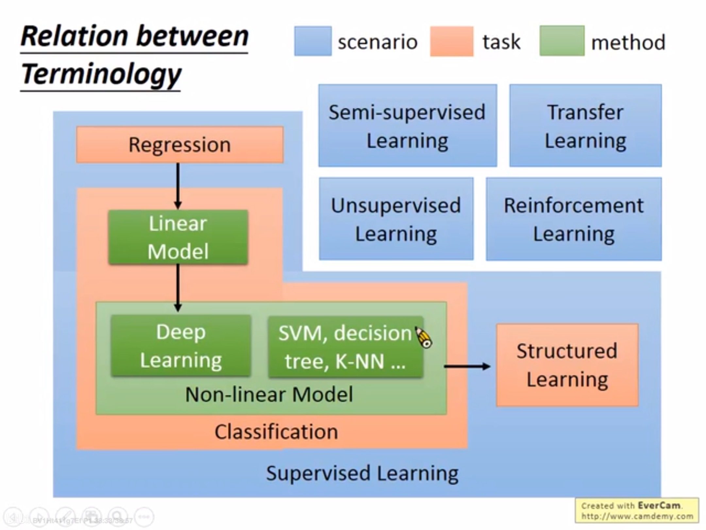

# Machine Learning Introduction

> *机器学习介绍*

## relationship among AI,ML,DL

> *人工智能、机器学习、深度学习的关系*

AI -- purpose -- want machine as smartly as human beings

ML -- method

DL -- one way

> *人工智能是人们想要实现的目标，想让机器跟人一样聪明*
>
> > *机器学习是人们实现目标的方法*
> >
> > > *深度学习是机器学习的一种方法*

## creature vs machine in learning

> *从生物学习方式类比到机器学习上*

**① nature**

+ creature : if(听到水流声) --> output(筑水坝)

+ machine : hand-crafted rules 

  + a joke IFs AI 

  .JPG)

  + eg : ''turn off'' ''don't turn off'

> weakness of hand-crafted
>
> > can't consider all possibilities and a lot of human efforts
>
> so we need nurture

**② nurture**

+ creature : experiences and learning

+ machine : learn from datas

  

## what is machine learning?

> 机器学习是什么

**look for function from data**

## Framework

**a supervised process**

1. model = define a functional dataset  f(pic1) = 'cat', f(pic2) = 'dog'...

2. goodness of function

3. choose a best function(f*) to test

## Learning Map

### Supervised

> labelled dataset

**Regression :** f's output is scaler

**Classification ：**

1. Linear Model
2. Non-linear Model
   + Deep learning
   + SVM, KNN, decision tree
   + ...

**Classification possible results:**

1. Binary : YES/NO
   + Spam-fliterring
2. Multi-class : which class
   + documents type classification

**Structured learning (difficult!!)**: outputs are not only scaler , like pictures, sentences...

### Semi-supervised

> labelled (less) + unlabelled(more)  and they are related

.JPG)

### Transfer Learning

> labelled (less) + unlabelled(more)  and they are unrelated

.JPG)

### Reinforcement Learning

> unlabelled dataset

## Reinforcement Learning Vs. Supervised Learning

Reinforcement Learning -- 》 learn from evaluations/scores

Supervised Learning -- 》 learn from teacher

> tips : use the Reinforcement Learning when labelled datas used in supervised is not enough
>
> ​	like : Alpha Go

## Summary

1. We need machine smart like humans so we take use of hand-crafted rules and machine learning including linear and non-linear model to train  the machine choosing a best function.
2. Too many hand-crafted rules is stupid and waste time.
3. Training need a lot of datas, may be labelled and unlabelled, and compare the goodness of each function to determin the best.
4. Structured Learning may be the hardest thing contrasted to regression and classification.
5. I thought we will learn how to deal with and get dataset, how to train in different cases, how to measure the best f*.